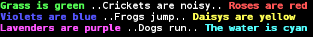

rainbow.sh
==========

Simple colors for your scripts

## How does it look?

##Usage

Just import rainbow.sh and start using the available functions in your scripts.

Remember you need to save the output of the desired color function to a variable and print that later, or if you wish to print the whole text in one color just use `echogreen "my green text"`.

~~~~
source rainbow.sh 

vargreen=$(echogreen "Grass is green")
varred=$(echored "Roses are red")

varblue=$(echoblue "Violets are blue")
varyellow=$(echoyellow "Daisys are yellow")

varpurple=$(echopurple "Lavenders are purple")
varcyan=$(echocyan "The water is cyan")

echo "$vargreen ..Crickets are noisy.. $varred"
echo "$varblue ..Frogs jump.. $varyellow"
echo "$varpurple ..Dogs run.. $varcyan"
~~~~

## Tips

* Don't forget to quote parameteres, `echogreen one big apple tree` will only output "one", you should use `echogreen "one big apple tree"` to get the full output.

* If you wish a darker color palette just redefine `__RAINBOWPALETTE` to `0` like this: `__RAINBOWPALETTE="0"`

The dark palette looks like this:

